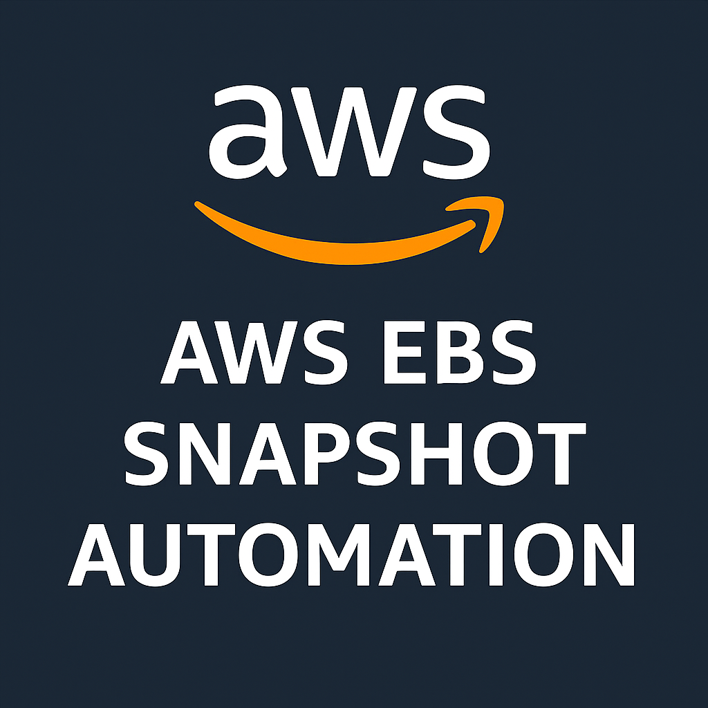
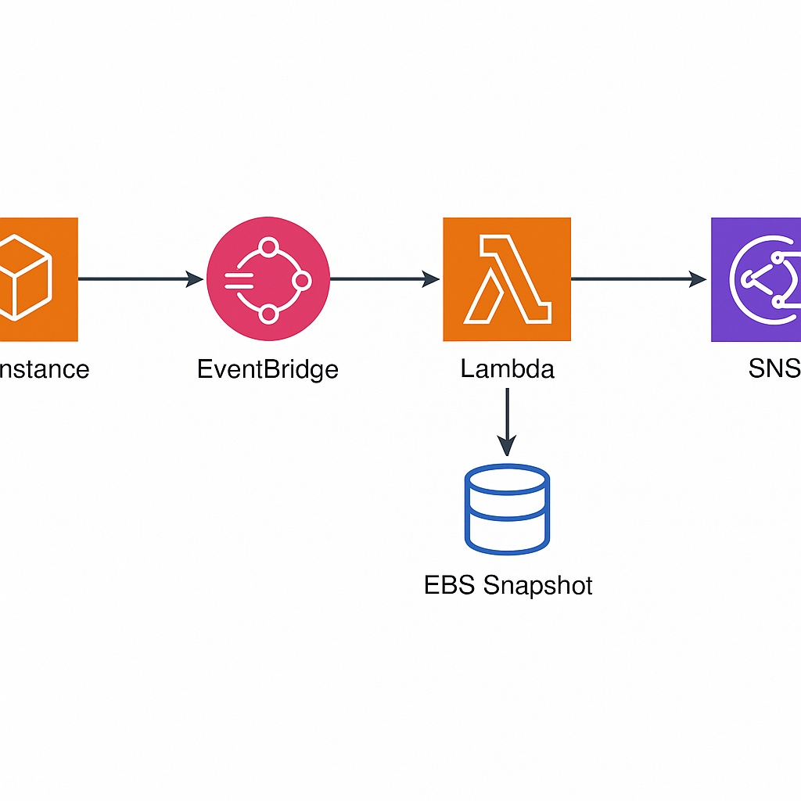

<p align="center">
  
</p>

<p align="center">
  <a href="https://github.com/MrSiddu73">
    
  </a>
</p>

# 🧠 AWS EBS Snapshot Automation


*Serverless backup system using AWS Lambda, EventBridge, and SNS.*

This project automatically creates EBS snapshots whenever an EC2 instance transitions to the **running** state.
Backups run **only** when the instance is tagged:

```
Backup = true
```

After snapshot creation, Amazon SNS sends a **success email notification**.

---

## 🚀 Overview

This system provides:

* **Automatic, event-driven backups**
* **Tag-based control** (`Backup=true`)
* **Serverless execution** (No EC2 scripts or cron jobs)
* **Least-privilege IAM**
* **SNS email notifications**
* **CloudWatch logs for debugging**

---

## 🧱 Architecture



**Flow:**

1. EC2 (tagged `Backup=true`) enters `running` state
2. EventBridge detects the event
3. Lambda function executes snapshot creation
4. Snapshot is tagged and stored
5. SNS sends email confirmation

---

## 🪜 Quick Deployment Steps

### 1️⃣ Create SNS Topic

* SNS → Topics → **Create Topic** → Standard
* Name: `EBSBackupNotifications`
* Add subscription → Email
* Confirm subscription from your inbox

---

### 2️⃣ Create IAM Role for Lambda

Attach `iam/lambda_policy.json` to the role.
This grants:

* Describe instances
* Create snapshots
* Add tags
* Publish SNS messages
* Write CloudWatch logs

---

### 3️⃣ Create the Lambda Function

* Runtime: **Python 3.9**
* Upload `lambda/snapshot_creator.py`
* Set environment variable:

```
SNS_TOPIC_ARN = arn:aws:sns:<region>:<account-id>:EBSBackupNotifications
```

* Assign the IAM role from Step 2

---

### 4️⃣ Create EventBridge Rule

Use the event pattern from:
`eventbridge/event_pattern.json`

This triggers Lambda when an EC2 instance changes state → `running`.

---

### 5️⃣ Tag the EC2 Instance

Add this tag so it gets backed up:

```
Key: Backup
Value: true
```

---

### 6️⃣ Test the Automation

1. Stop → Start your EC2 instance
2. Check CloudWatch Logs
3. Go to EC2 → Snapshots → verify snapshot
4. Check email for SNS notification

---

## 📸 Proof of Execution


### 💬 SNS Email Proof

[AWS SNS Snapshot Success Email (PDF)](docs/Snapshot-success.pdf)

---

## 🔖 Tag Logic

The Lambda accepts:

```
Backup = true
backup = true
```

This avoids failures due to case-sensitive tag mismatches.

---

## ⚙️ AWS Services Used

| Service             | Purpose                         |
| ------------------- | ------------------------------- |
| **EC2**             | Source instance & EBS volumes   |
| **EBS**             | Snapshots created automatically |
| **EventBridge**     | Detects instance state changes  |
| **Lambda**          | Performs snapshot creation      |
| **SNS**             | Sends backup notifications      |
| **CloudWatch Logs** | Stores Lambda logs              |

---

## 🧩 My Contributions

Developed and customized by **Siddu S.N**, including:

* Implemented tag-based snapshot creation logic
* Added SNS email notification integration
* Implemented least-privilege IAM policy
* Structured repo into `lambda/`, `iam/`, `eventbridge/`, `docs/`
* Created architecture diagram & execution proof
* Documented entire setup for easy reproduction

---

## 📂 Repository Structure

```
aws-ebs-snapshot-automation/
│── lambda/
│   └── snapshot_creator.py
│── iam/
│   └── lambda_policy.json
│── eventbridge/
│   └── event_pattern.json
│── docs/
│   ├── architecture.jpg
│   ├── test-result.jpg
│   └── Snapshot-success.pdf
│── README.md
│── LICENSE
│── .gitignore
```

---

🧭 SIMPLE SETUP CHECKLIST (step-by-step summary)
| Step | Action                                                    | Where               |
| ---- | --------------------------------------------------------- | ------------------- |
| 1️⃣  | Create **SNS Topic** and confirm email                    | SNS console         |
| 2️⃣  | Create **IAM Role** with `iam_policy.json`                | IAM console         |
| 3️⃣  | Create **Lambda Function** with `lambda_function.py`      | Lambda console      |
| 4️⃣  | Add environment variable `SNS_TOPIC_ARN`                  | Lambda config       |
| 5️⃣  | Attach IAM Role to Lambda                                 | Lambda permissions  |
| 6️⃣  | Create **EventBridge Rule** using `eventbridge_rule.json` | EventBridge console |
| 7️⃣  | Add tag `Backup=true` to EC2 instance                     | EC2 console         |
| 8️⃣  | Start EC2 → verify snapshot + email                       | EC2 & email inbox   |

## 🚀 Future Improvements
- Add cleanup Lambda to delete old snapshots
- Add SNS notification for failures
- Add Terraform/CloudFormation automation

## 📜 License

MIT License

